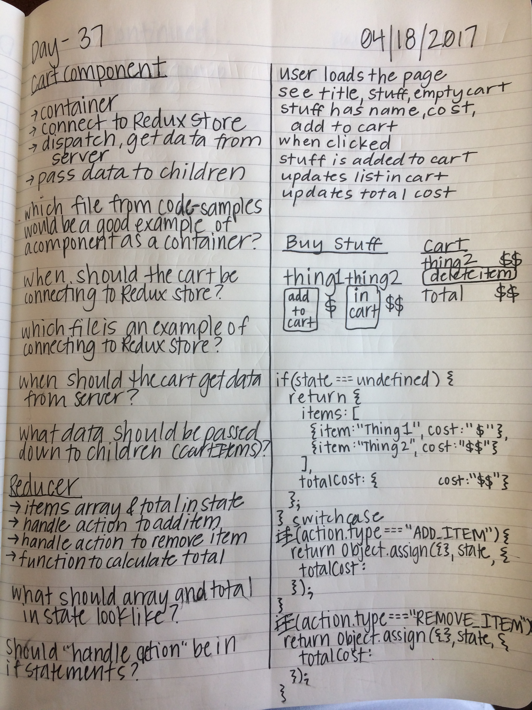

What is it?
-----------

TIY Front End Development Spring 2017 assignment

What does it do?
----------------

Practice Creating Reusable Components

**Explorer Mode**

Use React and Redux to create a simple shopping cart application.

You should make a Cart and a CartItem component.
The cart component should be a 'container' component, which means it should:
Connect to the Redux store.
be responsible for dispatching the action to fetching data from the server
pass all necessary data down to its children (The CartItems)
The reducer should:
have (at a minimum) an items array and a total in the state
handle a custom action through which one could add a new item to it
handle a custom action through which one could remove an item from it
have a custom function that calculates the total based on the items currently in the cart
Your app should display:
The items in the cart in a tabular format
The current correct total cost.
Your app should allow users to add or remove items from the cart's inventory.
**NOTES**
The idea behind this app is to create a generic shopping cart that could be re-used on any application. All you really NEED for that to be accomplished is the above 2 components and a single store/reducer. Of course, in order to see that your cart actually works, you will also have to generate a list of items available for sale so that you can try adding and removing them to/from the cart. This can be hard coded to begin with, but should be moved to backendless.

**Adventurer Mode**

Add a quantity modifier to your cart. A user should be able to click an up or down arrow and change the quantity of that item, thus changing their total.

**Epic Mode**

Create "complete purchase" functionality into your cart. You will probably want to integrate Stripe into the cart so that you are prepared to take payments!

App Planning
------------

  

Live version
------------

languid-relation.surge.sh

--------------------------------------------------------------------------------
Created by Devon Moubry.
devon@moubry.com
